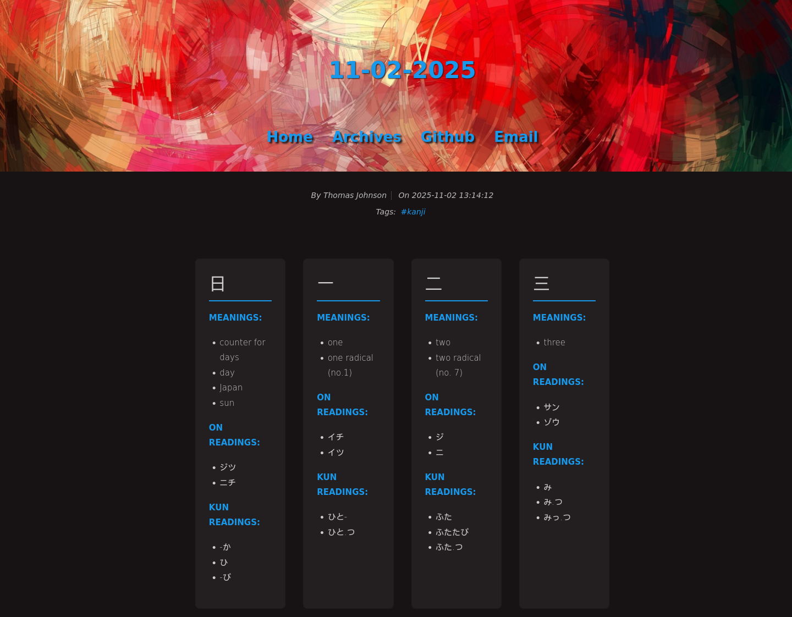
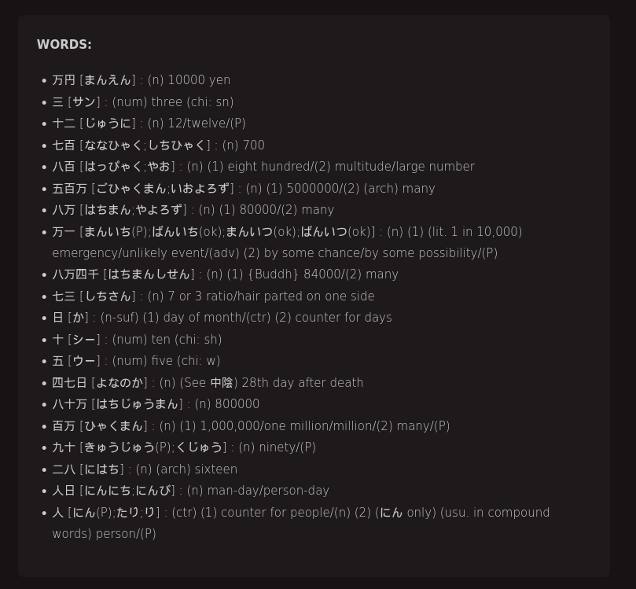
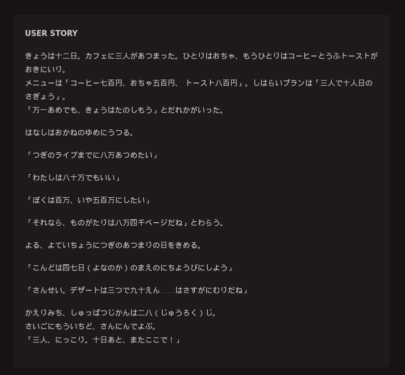

# Hexo JP KLC

## Hexo-Based Japanese KLC Practice Blogging

## Overview

This project is designed for studying the KLC list of kanji by introducing a fixed number of kanji per blog entry and encouraging the creation of sentences that use a a selection of words gathered from all "known" kanji.

## Design

Each blog entry will introduce a fixed number of kanji from the KLC list, in order introduced in the KLC book. The last known kanji number is stored in config.yaml. The daily script increments this number and fetches the daily kanji and a selection of words that use all known kanji, including the new kanji for today.

The note generated displays each kanji, along with a brief description and readings. Sample words are also included that use only known kanji.
It is the task of the writer to construct some sentences that use these words, ideally in some sort of story. The story does not have to make sense; the idea is that it will help understand how these kanji and words are used in context. This will help build vocabulary and reinforce grammar, provided some time is spent verifying that the usage of the words is correct and the readings are appropriate.
There is no time limit to finishing a blog post, so each entry does not have to be daily. But in the interest of learning 2300 kanji, it is recommended to write a blog entry at least a few times a week.

## Daily Kanji with Meanings and On/Kun Readings



## Daily Random Selection of Words with Only Known Kanji



## User Story Section


## Tech Stack: Host

- [Arch Linux](https://archlinux.org/) or another flavor of Linux (or WSL if using Windows) is used as the base OS.
- [Docker](https://www.docker.com/products/docker-desktop/) or [Rancher Desktop](https://rancherdesktop.io/) is used locally to host Postgresql.
- [GNU Make](https://www.gnu.org/software/make/) is used as a command runner for development tasks.
- [Node JS](https://nodejs.org/en) is used with [Hexo](https://hexo.io/index.html) to serve as a static website generator.
- [Perl 5](https://www.perl.org) + [DBI](https://dbi.perl.org/) + [DBD::Pg](https://metacpan.org/pod/DBD::Pg) is used for DB scripts and daily page generation.

## Tech Stack: DB Container

- [Postgresql](https://www.postgresql.org/) is used for the DB backend (used for note creation only).

## Suggested Linux/WSL Packages

```shell
openssl rsync curl glibc git vi vim nano wget ninja cmake iproute2 python python-virtualenv \
libpqxx unzip openssh man-db man-pages htop inetutils perl perl-dbi perl-dbd-pg perl-yaml-tiny \
postgresql nodejs npm icu expat make
```

## Windows Notes

- If you are using Windows, it is recommended to use [WSL](https://docs.microsoft.com/en-us/windows/wsl/install) to run the commands in this readme.
- If using WSL, it is recommended to use [ArchWSL](https://github.com/yuk7/ArchWSL) as a distribution, though others should work as well.

## Initial one-time setup

1. Clone this (or your) repository. Change URL as needed. `git clone https://github.com/darkmusic/hexojp-klc`
1. Initialize submodules if needed. `git submodule update --init --recursive`
1. Copy `db/config_template.yaml` to `db/config.yaml` and edit accordingly.
1. Copy `_config_template.yml` to `_config.yml` and edit accordingly.
1. Copy `settings_template.env` to `settings.env` and edit accordingly.
1. Run `make init` to initialize the containers.
1. Wait a bit for the containers to start up, especially the DB container as this needs to initialize the database and restart (5-10 seconds).
1. Run `make db-restore` to restore the DB.

## Perl module installation

First-time setup requires Perl modules: `sudo apt install libdbi-perl libdbd-pg-perl libyaml-tiny-perl` or `cpan DBI DBD::Pg YAML::Tiny`.

## Regular daily steps

1. `make daily`
2. Edit note as needed (under **source/\_posts**).
3. `make generate` (or `hexo generate`)
4. `make server` (or `hexo server`; adjust port as needed by adding `--port 4010` for example; recommended to run this under PowerShell / CMD on Windows, as WSL can have issues exposing ports)
5. [View the site in a browser.](http://localhost:4000)

## As needed

- Edit \_config.yml, then run `make generate`
- Edit themes, then run `make generate`
- Edit scaffolds, then run `make generate`
- Edit db/config.yaml, then run `make generate`
- Edit any post under source/\_posts, then run `make generate`
- Run `make docker-up` to start the docker container.
- Run `make docker-stop` to stop the docker container.
- Run `make docker-build` to pull the latest PostgreSQL image.
- Run `make db-connect` to connect to the db container.
- Run `make db-logs` to see the db container logs.
- Run `make help` to see all available commands.

## System Requirements

Windows, Linux, or Mac should work.

## Config

The config.yaml defaults should work fine. As-is, the defaults will include kanji 1-20 in the initial blog entry.

By default, this will start from **last_known_klc_num + 1** (1), and end at **start + daily_study_number** (20). Only sample words containing these 20 kanji (and any kana) will be included.
After creating the daily note, the **last_known_klc_num** will be incremented to 20.

You can always manually edit the **last_known_klc_num** if needed.

```yaml
daily_study_number: 20
database: hexojp
host: localhost
last_known_klc_num: 0
max_words: 50
password: hexojpadmin
port: 5432
userid: hexojpadmin
```

## Using submodules for themes

It can be convenient to use submodules for themes.

For example:

```shell
cd themes
git submodule add https://github.com/xbmlz/hexo-theme-maple.git
make generate
make server
```

With this, you can do a `git add` on your repository and it will add the submodule instead of adding everything inside the theme's folder. Also if you re-clone your repository from scratch, if you follow the instructions in the **Initial one-time setup** above, your themes will be downloaded automatically.

## Responsive column display configuration

When only using a single column to display the kanji cards, it requires a lot of vertical scrolling. To improve usability, you can configure the kanji grid to use multiple columns based on screen size.
The *.styl file for configuring this will depend on the theme you are using. For example, for **hexo-theme-aero-dual**, edit `themes/hexo-theme-aero-dual/source/css/_base.styl`.
You can use the following code to create a responsive kanji grid that adjusts the number of columns based on the screen size:

```stylus
.kanji-grid
  display grid
  gap 2rem
  margin 2rem 0

  // Mobile: 1 column
  grid-template-columns 1fr

  // Tablet: 2 columns
  @media (min-width: 768px)
    grid-template-columns repeat(2, 1fr)

  // Desktop: 3 columns
  @media (min-width: 1024px)
    grid-template-columns repeat(3, 1fr)

  // Large desktop: 4 columns
  @media (min-width: 1440px)
    grid-template-columns repeat(4, 1fr)

.kanji-card
  border 1px solid rgba(0, 0, 0, 0.1)
  padding 1.5rem
  border-radius 8px
  background-color rgba(255, 255, 255, 0.05)
  transition all 0.3s ease

  &:hover
    box-shadow 0 4px 12px rgba(0, 0, 0, 0.15)
    transform translateY(-2px)

  h2
    margin-top 0
    font-size 2rem
    color $theme-text-color
    border-bottom 2px solid $theme-color
    padding-bottom 0.5rem
    margin-bottom 1rem

  strong
    color $theme-color

.kanji-word
  grid-column 1 / -1
  padding 1.5rem
  border-radius 8px
  background-color rgba(255, 255, 255, 0.03)
  margin 1rem 0
```

If the theme instead uses standard CSS files, you can use the following CSS code:

```css
.kanji-grid {
  display: grid;
  gap: 2rem;
  margin: 2rem 0;
  grid-template-columns: repeat(auto-fit, minmax(200px, 1fr));
}
.kanji-card {
  border: 1px solid rgba(0, 0, 0, 0.1);
  padding: 1.5rem;
  border-radius: 8px;
  background-color: rgba(255, 255, 255, 0.05);
  transition: all 0.3s ease;
}
.kanji-card:hover {
  box-shadow: 0 4px 12px rgba(0, 0, 0, 0.15);
  transform: translateY(-2px);
}
.kanji-card h2 {
  margin-top: 0;
  font-size: 2rem;
  color: var(--theme-text-color);
  border-bottom: 2px solid var(--theme-color);
  padding-bottom: 0.5rem;
  margin-bottom: 1rem;
}
.kanji-card strong {
  color: var(--theme-color);
}
.kanji-word {
  grid-column: 1 / -1;
  padding: 1.5rem;
  border-radius: 8px;
  background-color: rgba(255, 255, 255, 0.03);
  margin: 1rem 0;
}
```

## Example for adding a theme and dealing with theme-related issues

Using [hexo-theme-clean-dark](https://github.com/howardliu-cn/hexo-theme-clean-dark) as an example, do the following:

1. Add submodule to themes directory

```shell
cd themes
git submodule add https://github.com/howardliu-cn/hexo-theme-clean-dark
```

1. Read installation notes at [the theme repo](https://github.com/howardliu-cn/hexo-theme-clean-dark). Note that this particular theme repo is in Chinese, but it is usually not required to know how to read Chinese even if the readme for the repo is entirely in Chinese. In this particular repo, there are steps listed where are pretty straightforward. Note that you can skip the "clone" step as you already added the submodule. If it's still to difficult to understand the repository readme, go to [Google Translate - websites](https://translate.google.com/?sl=zh-CN&tl=en&op=websites) and enter the URL for the repository and translate to your desired language. For this example, the translated repository (from Simplified Chinese to English) is [here](https://github-com.translate.goog/howardliu-cn/hexo-theme-clean-dark?_x_tr_sl=zh-CN&_x_tr_tl=en&_x_tr_hl=en&_x_tr_pto=wapp).

In this particular theme repository, there is the next step of adding a NPM dependency. This can be done by doing the following:

```shell
npm install --save hexo-renderer-sass
exit
```

1. Edit themes/\_config.yml to change the theme (in this case to hexo-theme-clean-dark).
1. Edit the theme's config.yml (in this case themes/hexo-theme-clean-dark/\_config.yml) as needed according to the theme's readme.
1. Generate:
   ```shell
   make generate
   ```
1. If you encounter an error about the `strip-ansi` npm package, you may need to manually update `node_modules/hexo/dist/plugins/console/list/common.js` to replace _require_ with _import_.
1. Take note of any other errors during the generation process and fix as needed. If you are not familiar or comfortable with troubleshooting such errors, it may be easier to pick a different theme.
   Example error:

```shell
ERROR
ReferenceError: /home/hexojp/code/hexojp/themes/hexo-theme-clean-dark/layout/post.ejs:17
    15|         </div>
    16|         <div class="post-content article-entry">
 >> 17|             <!-- <%- partial('_partial/toc') %> -->
    18|             <%- page.content %>
    19|         </div>
    20|         <% if(page.tags){ %>

/home/hexojp/code/hexojp/themes/hexo-theme-clean-dark/layout/_partial/toc.ejs:1
 >> 1| <% if (post.toc != false) { %>
    2|     <div id="toc">
    3|       <%- toc(post.content, {list_number: false}) %>
    4|     </div>

post is not defined
    at eval ("/home/hexojp/code/hexojp/themes/hexo-theme-clean-dark/layout/_partial/toc.ejs":10:8)
    at toc (/home/hexojp/code/hexojp/node_modules/ejs/lib/ejs.js:703:17)
    at _View._compiledSync (/home/hexojp/code/hexojp/node_modules/hexo/lib/theme/view.js:132:24)
    at _View.renderSync (/home/hexojp/code/hexojp/node_modules/hexo/lib/theme/view.js:59:25)
    at Object.partial (/home/hexojp/code/hexojp/node_modules/hexo/lib/plugins/helper/partial.js:34:15)
    at eval ("/home/hexojp/code/hexojp/themes/hexo-theme-clean-dark/layout/post.ejs":25:17)
    at post (/home/hexojp/code/hexojp/node_modules/ejs/lib/ejs.js:703:17)
    at _View._compiled (/home/hexojp/code/hexojp/node_modules/hexo/lib/theme/view.js:136:50)
    at _View.render (/home/hexojp/code/hexojp/node_modules/hexo/lib/theme/view.js:39:17)
    at /home/hexojp/code/hexojp/node_modules/hexo/lib/hexo/index.js:64:21
    at tryCatcher (/home/hexojp/code/hexojp/node_modules/bluebird/js/release/util.js:16:23)
    at /home/hexojp/code/hexojp/node_modules/bluebird/js/release/method.js:15:34
    at RouteStream._read (/home/hexojp/code/hexojp/node_modules/hexo/lib/hexo/router.js:47:5)
    at Readable.read (node:internal/streams/readable:737:12)
    at resume_ (node:internal/streams/readable:1255:12)
    at process.processTicksAndRejections (node:internal/process/task_queues:82:21)
```

This one looks daunting, but is actually easy to fix. In themes/hexo-theme/clean/dark/layout/post.ejs, the commented-out block in line 17 is causing the issue, so just delete that line and do a sync, fix permissions, and generate to try again.

Note that you may get deprecation warnings like the following:

```shell
Deprecation Warning: Using / for division outside of calc() is deprecated and will be removed in Dart Sass 2.0.0.

Recommendation: math.div(30em, 14) or calc(30em / 14)

More info and automated migrator: https://sass-lang.com/d/slash-div

   ╷
12 │ $fa-li-width:         (30em / 14) !default;
   │                        ^^^^^^^^^
   ╵
    themes/hexo-theme-clean-dark/source/css/font-awesome/scss/_variables.scss 12:24  @import
    themes/hexo-theme-clean-dark/source/css/font-awesome/scss/font-awesome.scss 6:9  root stylesheet
```

This is a sass warning, which is actually quite detailed and gives you suggestions on how to fix this.

It's optional to fix these, but if you know how to, I would recommend it as it cleans up these warnings.

In this case, these calculations need to happen inside a **calc()** block, so just add **calc** in front of the math operations that are mentioned. For example, **(30em / 14)** becomes **calc(30em / 14)**.

Continue once you have reduced or eliminated all errors and warnings.

1. Start server

```shell
make server
```

1. Check the [website](http://localhost:4000) to see if any updates are needed.

You may notice that the website does not look correct; perhaps the fonts don't look right, or things aren't aligned as expected. If you're not comfortable with adjusting CSS, then you may wish to find another theme.

For this example theme, below are some updates that I made to get things to look a bit more normal on my system. This is just an example of the types of updates you may need to make.

Even with this updates to the hexo-theme-clean-dark, it still doesn't look exactly like the theme repo's screenshot, and the fonts don't look the best, so your mileage may vary based on what updates you make (and the time you want to spend messing with CSS). This is the case with many Hexo themes - they don't work right or look right. This is not the direct fault of the repo owner because libraries (including NPM libraries such as hexo, sass etc.) and browser technologies (such as CSS) go through evolutions and sometimes significant changes that may break or cause issues with legacy websites. Many Hexo themes can be considered "legacy websites" in this case, because many have not been updated in several years and are unmaintained. So while these issues are not the direct fault of the repo owner, any issues with the theme should be reported to the repo owner so they are aware of the issue and can make fixes. But with many github repos, issues opened may sit eternally without being resolved, so oftentimes reporting github issues isn't helpful. It all depends on how responsive and active the repo owner is.

Even these example updates will become obsolete at some point once the CSS spec or SASS changes again, so just use this as a general guide for the types of updates you may need to make.

- In theme_scss:

  - .footer:

    - add:

      ```css
      height: 50px;
      ```

  - .well.post-nav.a:

    - Comment out "float: left"

      ```css
      //float: left;
      ```

  - nav.a:

    - add:

      ```css
      padding-left: 5px;
      padding-right: 5px;
      ```

    - Change font-family to:

      ```css
      font-family: ubuntu, icomoon, "Segoe UI", Tahoma, Geneva, Verdana,
        sans-serif;
      ```

  - navbar .navbar-nav:

    - change display to:

      ```css
      display: flex;
      ```

    - Comment out "float: left"

      ```css
      //float: left;
      ```

    - add flex-direction: row

      ```css
      flex-direction: row;
      ```

  - .content:

    - add:

      ```css
      padding-left: 50px;
      padding-right: 50px;
      ```

## Other notes

- To re-generate a daily note, you'll need to delete the post and then run the `make daily` task again:

```shell
rm source/_posts/05-05-2025.md
make daily
```

- The DB contains kanji imported from [KANJIDIC](http://www.edrdg.org/wiki/index.php/KANJIDIC_Project) using [KanjiDicParser](https://github.com/WinteryFox/KanjidicParser), and words imported from [EDICT](http://www.edrdg.org/jmdict/edict.html). A list of 2300 KLC kanji was used to number the KLC kanji in the DB.
- The `db/daily.pl` script has all of the logic for generating the daily note. This makes use of a procedure called `add_matching_words` to perform a regex match (using all known kanji) against the word table and populating a known_words table with results. It also queries other tables to retrieve kanji-specific information.
- The character 〇 (KLC 14) is ignored, as it is not a kanji.
- The Hexo theme is configurable. See: [Hexo Themes](https://hexo.io/themes/index.html). It should be noted that not all Hexo themes work properly, so you may have to adjust things or find another theme if you run into issues.
- The initial DB import may get a tablespace error. You may need to edit dockerfiles/db/init-user-db.sh (where it says _Tablespace for initial db import_) to adjust the path. If you don't know what path to use, run `make db-connect` and look around in the container (under /var/lib/postgresql/data/pg_tblspc/) and see what the folder is named, and adjust the script as needed. But currently there is a wildcard, so this may not be required.
